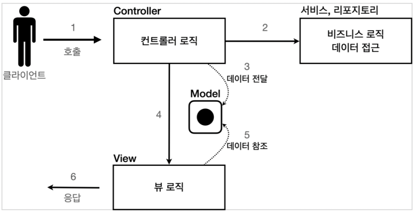
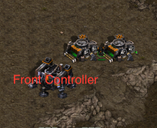
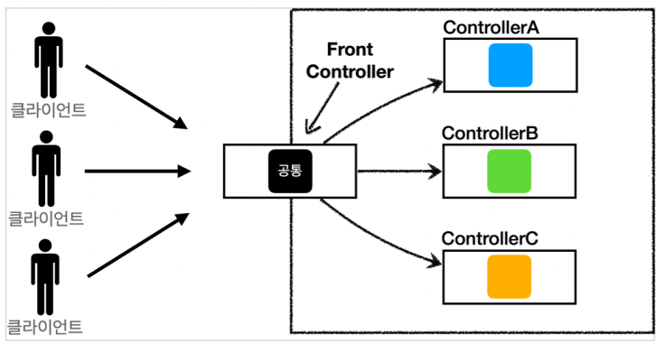
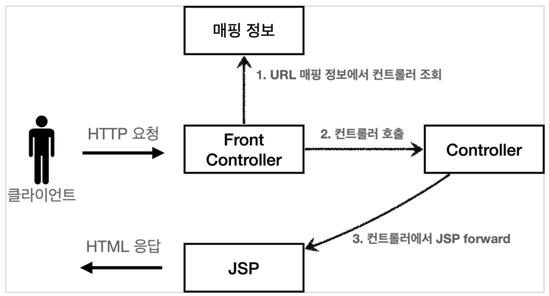
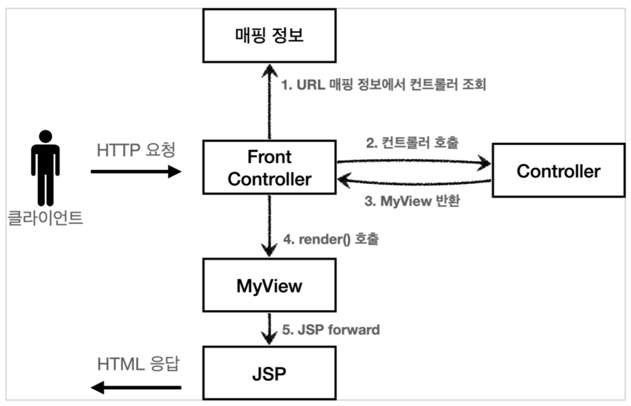
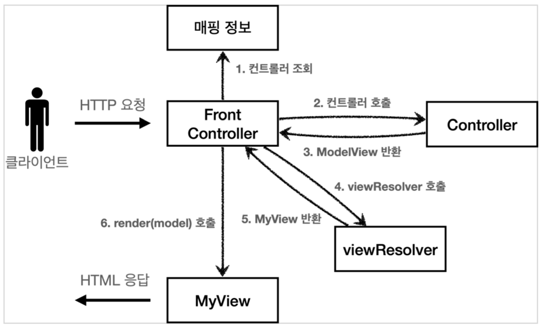
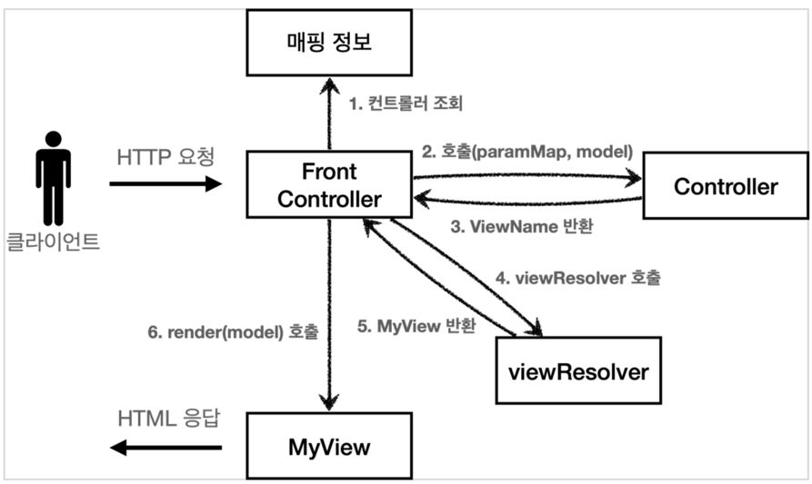
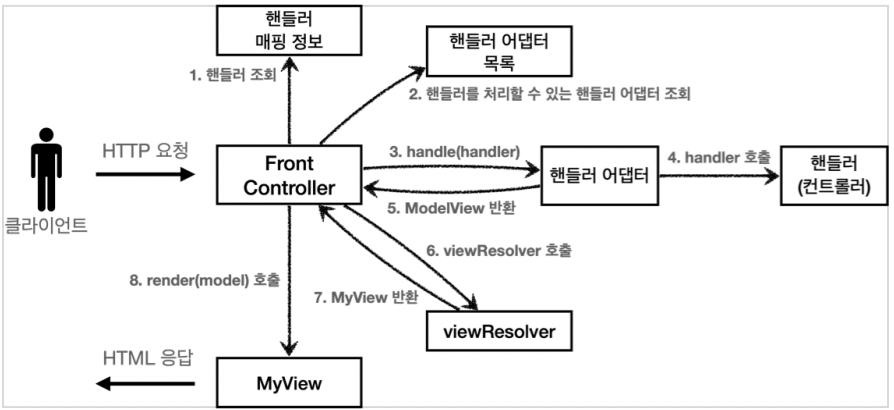
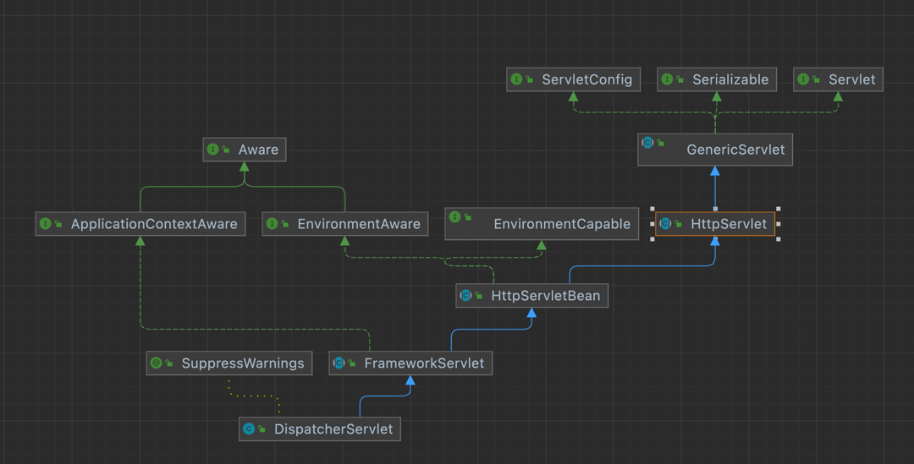

# MVC 1편 실습(with 김영한)

## 목표
서블릿의 기능과 기본적인 MVC패턴을 이해하자

## MVC 패턴 개요
### *너무 많은 역할*

`하나의 서블릿`이나 `JSP`만으로 `비지니스 로직`과 `뷰 렌더링`까지 `모두 처리`하게 되면, `너무 많은 역할`을 하게됨.<br>
`결과적으로 유지보수가 어려움.`<br>
HTML 코드 하나 수정해야 하는데, 수백줄의 자바 코드가 함께 있다고 생각해보자.. 🙀<br>

### *변경의 라이프 사이클*

`뷰`와 `비지니스 로직`의 변경의 `라이프 사이클`이 `다르다.!`<br>
이렇게 변경의 라이프 사이클이 다른 부분을 하나의 코드로 관리하는 것은 유지보수하기 좋지 않다.

### *기능 특화*

`JSP 같은 뷰 템플릿은 화면을 렌더링 하는데 최적화` 되어있기 때문에 이 부분의 업무만 담당하는 것이 가장 효과적!

### *Model View Controller*
<p align="center">
    
</p>

**컨트롤러**
* HTTP요청을 받아서 `파라미터를 검증`하고, `비지니스 로직을 실행`한다.
그리고 `뷰에 전달할 결과 데이터를 조회`해서 `모델에 담는다.`<br>

**모델**
* `뷰에 출력할 데이터를 담아둔다.` 
뷰가 필요한 데이터를 모두 모델에 담아서 전달해주는 덕분에 뷰는 `비지니스 로직이나 데이터 접근을 몰라도 되고, 
화면을 렌더링하는 일에 집중`할 수 있다.<br>

**뷰**
* `모델에 담겨있는 데이터를 사용해서 화면을 그리는 일`에 집중한다.
여기서는 HTML을 생성하는 부분을 말한다.<br><br>


## MVC 패턴 적용
`/hello/servlet/web/servletmvc/***.java`<br>
`webapp/WEB-INF/views/***.jsp`<br>
에 실습을 진행함.(실습에서는 서비스를 분리하여 구현하지는 않았다.)

```java
/**
 * MVC 패턴 적용
 * 서블릿: 컨트롤러
 * JSP: 뷰
 * 모델: HttpServletRequest 객체
 * (request는 내부에 데이터 저장소를 갖고 있는데,
 * request.setAttribute(), request.getAttribute()를 사용하면 데이터를 보관하고 조회 가능)
 */
@WebServlet(name = "mvcMemberFormServlet", urlPatterns = "/servlet-mvc/members/new-form")
public class MvcMemberFormServlet extends HttpServlet {
    /**
     * 클라이언트에서 MvcMemberFormServlet 호출
     * MvcMemberFormServlet의 service에서 jsp 호출(forward이기 때문에 서버 내부에서 호출한다.)
     */
    @Override
    protected void service(HttpServletRequest request, HttpServletResponse response) throws ServletException, IOException {
        /**
         * WEB-INF 이 경로안에 JSP가 있으면 외부에서 직접 JSP를 호출할 수 없다.
         * 항상 컨트롤러를 통해서 JSP를 호출하는 것
         */
        String viewPath ="/WEB-INF/views/new-form.jsp";
        RequestDispatcher dispatcher = request.getRequestDispatcher(viewPath);
        /**
         * 다른 서블릿이나 JSP로 이동할 수 있는 기능이다.
         * 서버 내부에서 호출이 발생
         */
        dispatcher.forward(request, response);

        /**
         * redirect vs forward
         * 리다이렉트는 실제 클라이언트에 응답이 나갔다가, 클라이언트가 리다이렉트 경로로 다시 요청한다.
         * 따라서 클라이언트가 인지할 수 있고, URL 경로도 실제로 변경
         * 반면에, 포워드는 서버 내부에서 일어나는 호출이기 때문에 클라이언트가 인식 할 수 없다.
         */
    }
}
```
```java
@WebServlet(name = "mvcMemberListServlet", urlPatterns = "/servlet-mvc/members")
public class MvcMemberListServlet extends HttpServlet {
    private MemberRepository memberRepository = MemberRepository.getInstance();

    @Override
    protected void service(HttpServletRequest request, HttpServletResponse response) throws ServletException, IOException {
        List<Member> members = memberRepository.findAll();
        request.setAttribute("members", members);

        String viewPath = "/WEB-INF/views/members.jsp";
        RequestDispatcher dispatcher = request.getRequestDispatcher(viewPath);
        dispatcher.forward(request, response);
    }
}
```
```java
@WebServlet(name = "mvcMemberSaveServlet", urlPatterns = "/servlet-mvc/members/save")
public class MvcMemberSaveServlet extends HttpServlet {

    MemberRepository memberRepository = MemberRepository.getInstance();

    @Override
    protected void service(HttpServletRequest request, HttpServletResponse response) throws ServletException, IOException {
        String username = request.getParameter("username");
        int age = Integer.parseInt(request.getParameter("age"));

        Member member = new Member(username, age);
        memberRepository.save(member);

        /**
         * Model에 데이터를 보관
         */
        request.setAttribute("member", member);

        String viewPath ="/WEB-INF/views/save-result.jsp";
        RequestDispatcher dispatcher = request.getRequestDispatcher(viewPath);
        dispatcher.forward(request, response);
    }
}
```
😭 실습을 진행하면서 계속 같은 코드를 ```반복```한다는 느낌을 받았다.

## MVC 패턴 한계
MVC 패턴을 적용한 덕분에 **컨트롤러의 역할과 뷰를 렌더링하는 역할을 명확하게 구분**할 수 있다.<br>
특히 뷰는 화면을 그리는 역할에 충실한 덕분에, 코드가 깔금하고 직관적이다.<br>
단순하게 모델에서 피룡한 데이터를 꺼내고, 화면을 만들면 된다. <br>
그런데 **컨트롤러는 딱봐도 중복이 많고, 필요하지 않는 코드**들도 많이 보인다.<br>

### *viewPaht에 중복*
```java
String viewPath ="/WEB-INF/views/save-result.jsp";
```

### *포워드 중복*

````java
    RequestDispatcher dispatcher = request.getRequestDispatcher(viewPath);
    dispatcher.forward(request, response);
````

만약 jsp가 아닌 thymeleaf같은 다른 뷰로 변경해야한다면 전체 코드를 다 변경해야 한다.
* prefix: `/WEB-INF/views`
* suffix: `.jsp`

### *사용하지 않는 코드*

response는 현재 코드에서 사용되지 않는다.
```java
HttpServletRequest request, HttpServletResponse response
```
`HttpServletRequest request`, `HttpServletResponse response`를 사용하는 코드는 테스트 케이스를 작성하기에도 어려움...


### *공통처리의 어려움*

기능이 복잡해질수록 컨트롤러에서 공통으로 처리해야 하는 부분이 점점 더 많이 증가할 것이다.<br>
단순히 공통 기능을 메서드로 뽑으면 될 것 같지만, 결과적으로 해당 메서드를 항상 호출 해야하고, 실수로 호출하지 않으면 문제가 발생!!<br>
그리고 호출하는 것 자체도 중복..<br>

### *결론*

공통 처리가 어렵다!!<br>
이 문제를 해결하기 위해서는 컨트롤러 호출 전에 먼저 공통 기능을 처리해야한다.<br>
> 즉, **수문장 역할**을 하는 기능이 필요

**프론트 컨트롤러(Front Controller)패턴**을 도입하면 이러한 문제를 깔끔하게 해결할 수 있다.
> 입구를 **하나**로!<br><br>
> <p align="center"></p>
스프링 MVC의 핵심도 바로 이 **Front Controller**에 있다.

# MVC 프레임워크 만들기
## 프론트 컨트롤러 패턴 특징
<p align="center">

</p>

* 프론트 컨트롤러 서블릿 하나로 클라이언트의 요청을 받음
* 프론트 컨트롤러가 요청에 맞는 컨트롤러를 찾아서 호출
* 입구를 하나로!
* 공통 처리 가능!!
* 프론트 컨트롤러를 제외한 나머지 컨트롤러는 서블릿을 사용하지 않아도 된다.!

> ### **스프링 웹 MVC와 프론트 컨트롤러**<br>
> 
> 스프링 웹 MVC의 핵심은 바로 FrontController이다.<br>
> 스프링 웹 MVC의 `DispatcherServlet`이 `FrontController 패턴`으로 구현되어 있다.
>

### ControllerV1
<p>
    
</p>
V1 코드 참고

### ControllerV2
<p>

</p>

```java
/**
 * 기존 V1 Controller에서 했던 기능을
 * MyView를 통해서 한다.
 */
public class MyView {
    private String viewPath;

    public MyView(String viewPath) {
        this.viewPath = viewPath;
    }

    public void render(HttpServletRequest request, HttpServletResponse response) throws ServletException, IOException {
        RequestDispatcher dispatcher = request.getRequestDispatcher(viewPath);
        dispatcher.forward(request, response);
    }
}
```

### ControllerV3
> 이번 버전에는 컨트롤러에서 HttpServletRequest를 사용할 수 없다.
> 따라서 직접 `request.setAttribute()`를 호출할 수도 없다.
>
> **즉 `Model`이 별도로 필요하다.**
> 
<p>

</p>

**ModelView**<br>
지금까지 컨트롤러에서 서블릿에 종속적인 HttpServletRequest를 사용했다. 
그리고 Model도 `request.setAttribute()`를 통해 데이터를 저장하고 뷰에 전달했다.<br>
서블릿의 종속성을 제거하기 위해 Model을 직접 만들고, 추가로 View이름까지 전달하는 객체를 만들어보자.


### ControllerV4
#### *좋은 프레임워크란*
V3 컨트롤러는 서블릿 종속성을 제거하고 뷰 경로의 중복을 제거하는 등, 잘 설계된 컨트롤러이다.<br>
그런데 실제 컨트롤러 인터페이스를 구현하는 개발자 입장에서 보면,<br>
항상 `ModelView`객체를 생성하고 반환해야 하는 부분이 번거롭다.<br>
**좋은 프레임워크란** `아무리 아키텍처가 좋아도 개발자들에게 단순하고 실용적`이여야 한다.
<p>

</p>

기본적인 구조는 V3와 같다. 대신 컨트롤러가 `ModelView`를 반환하지 않고, `ViewName`만 반환한다.<br><br>
이번 버전은 `ModelView`가 없다.<br>
`model`객체는 파라미터로 전달되기 때문에 그냥 사용하면 되고, 그 결과로 뷰의 이름만 반환하면 된다.<br>

### ControllerV5
ControllerV3를 지원하는 어댑터를 구현해보자.
#### *어댑터 패턴*
지금까지 개발한 프론트 컨트롤러는 한가지 방식의 컨트롤러 인터페이스만 사용할 수 있다.<br>
`ControllerV3`, `ControllerV4`는 완전히 다른 인터페이스이다. 따라서 호한이 불가하다.!<br>
마치 V3는 110V, V4는 220V 콘센트 같은 것이다.<br>
이때 사용하는 것이 바로 어댑터이다.!!<br>
<p>

</p>

**핸들러 어댑터**
* 중간에 어탭터 역할을 하는 어댑터가 추가되었는데 이름이 핸들러 어탭터이다.
* 어탭터 역할을 해주는 덕분에 다양한 종류의 컨트롤러를 호출할 수 있다.

**핸들러**
* 컨트롤러의 이름을 더 넓은 위인 핸들러로 변경
* 어댑터가 있기 때문에 꼭 컨트롤러의 개념 뿐만 아니라 어떠한 것이든 해당하는 종류의 어댑터만 있으면 전부 처리 가능하기 때문

## 정리
* V1
  * 기존 구조를 최대한 유지하면서 `프론트 컨트롤러` 도입
* V2
  * 단순 반복 되는 `뷰 로직` 분리
* V3
  * `서블릿` 종속성 제거
  * `뷰 이름` 중복 제거
* V4
  * V3와 거의 비슷
  * 구현 입장에서 `ModelView`를 직접 생성해서 반환하지 않도록 편리한 인터페이스 제공
* V5
  * `어댑터` 도입
  * 어댑터를 추가해서 프레임워크를 유연하고 확장성 있게 설계

## 스프링 MVC
### 스프링 MVC 전체 구조
**우리가 만든 MVC**
<p>

</p>

**스프링 MVC**
<p>
<br><br>

</p>

#### *비교*
* `FrontController` -> `DispatcherServlet`
* `handlerMappingMap` -> `HandlerMapping`
* `MyHandlerAdapter` -> `HandlerAdapter`
* `ModelView` -> `ModelAndView`
* `viewResolver` -> `ViewResolver`
* `MyView` -> `View`

#### *동작 순서*
1. **핸들러 조회**: 핸들러 매핑을 통해 요청 URL에 매핑된 핸들러(컨트롤러)를 조회
2. **핸들러 어댑터 조회**: 핸들러를 실행할 수 있는 핸들러 어댑터 조회
3. **핸들러 어댑터 실행**: 핸들러 어댑터 실행
4. **핸들러 실행**: 핸들러 어댑터가 실제 핸들러 실행
5. **ModelAndView 어댑터 반환**: 핸들러 어댑터는 핸들러가 반환하는 정보를 ModelAndVie로 변환해서 반환
6. **viewResolver 호출**: 뷰 리졸버를 찾고 실행
7. **View 반환**: 뷰 리졸버는 뷰의 논리 이름을 물리 이름으로 바꾸고, 렌더링 역할을 담당하는 뷰 객체를 반환
8. **뷰 렌더링**: 뷰를 통해서 뷰를 렌더링

#### *인터페이스 살펴보기*
* **스프링 MVC의 가장 큰 장점**은 `DispatcherServlet` 코드의 변경 없이, 원하는 기능을 변경하거나 확장할 수 있다는 점!(대부분 인터페이스로 제공)
* 인터페이스들만 구현해서 `DispatcherServlet`에 등록하면 자신만의 컨트롤러를 개발 할 수 있다. 

#### *주요 인터페이스 목록*
* 핸들러 매핑: `org.springframework.web.servlet.HandlerMapping`
* 핸들러 어댑터: `org.springframework.web.servlet.HandlerAdapter`
* 뷰 리졸버: `org.springframework.web.servlet.ViewResolver`
* 뷰: `org.springframework.web.servlet.View`

```java
protected void doDispatch(HttpServletRequest request, HttpServletResponse response) throws Exception {
        HttpServletRequest processedRequest = request;
        HandlerExecutionChain mappedHandler = null;
        ModelAndView mv = null;
        // 1. 핸들러 조회
        mappedHandler = getHandler(processedRequest);
        if (mappedHandler == null) {
        noHandlerFound(processedRequest, response);
        return;
        }
        // 2. 핸들러 어댑터 조회 - 핸들러를 처리할 수 있는 어댑터
        HandlerAdapter ha = getHandlerAdapter(mappedHandler.getHandler());
        // 3. 핸들러 어댑터 실행 -> 4. 핸들러 어댑터를 통해 핸들러 실행 -> 5. ModelAndView 반환
        mv = ha.handle(processedRequest, response, mappedHandler.getHandler());
        processDispatchResult(processedRequest, response, mappedHandler, mv,
        dispatchException);
}
```
```java
private void processDispatchResult(HttpServletRequest request, HttpServletResponse response, HandlerExecutionChain mappedHandler, ModelAndView mv, Exception exception) throws Exception {
        // 뷰 렌더링 호출
        render(mv, request, response);
}
```
```java
protected void render(ModelAndView mv, HttpServletRequest request, HttpServletResponse response) throws Exception {
        
        View view;
        String viewName = mv.getViewName();
        
        // 6. 뷰 리졸버를 통해서 뷰 찾기, 7. View 반환
        view = resolveViewName(viewName, mv.getModelInternal(), locale, request);
        
        // 8. 뷰 렌더링
        view.render(mv.getModelInternal(), request, response);
}
```

### 
