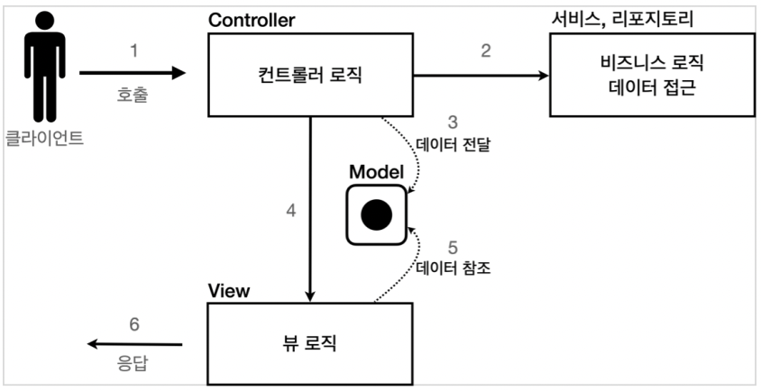
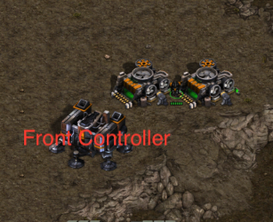

# MVC 1편 실습(with 김영한)

## 목표
서블릿의 기능과 기본적인 MVC패턴을 이해하자

## MVC 패턴 개요
### *너무 많은 역할*

`하나의 서블릿`이나 `JSP`만으로 `비지니스 로직`과 `뷰 렌더링`까지 `모두 처리`하게 되면, `너무 많은 역할`을 하게됨.<br>
`결과적으로 유지보수가 어려움.`<br>
HTML 코드 하나 수정해야 하는데, 수백줄의 자바 코드가 함께 있다고 생각해보자.. 🙀<br>

### *변경의 라이프 사이클*

`뷰`와 `비지니스 로직`의 변경의 `라이프 사이클`이 `다르다.!`<br>
이렇게 변경의 라이프 사이클이 다른 부분을 하나의 코드로 관리하는 것은 유지보수하기 좋지 않다.

### *기능 특화*

`JSP 같은 뷰 템플릿은 화면을 렌더링 하는데 최적화` 되어있기 때문에 이 부분의 업무만 담당하는 것이 가장 효과적!

### *Model View Controller*
<p align="center">
    
</p>

**컨트롤러**
* HTTP요청을 받아서 `파라미터를 검증`하고, `비지니스 로직을 실행`한다.
그리고 `뷰에 전달할 결과 데이터를 조회`해서 `모델에 담는다.`<br>

**모델**
* `뷰에 출력할 데이터를 담아둔다.` 
뷰가 필요한 데이터를 모두 모델에 담아서 전달해주는 덕분에 뷰는 `비지니스 로직이나 데이터 접근을 몰라도 되고, 
화면을 렌더링하는 일에 집중`할 수 있다.<br>

**뷰**
* `모델에 담겨있는 데이터를 사용해서 화면을 그리는 일`에 집중한다.
여기서는 HTML을 생성하는 부분을 말한다.<br><br>


## MVC 패턴 적용
`/hello/servlet/web/servletmvc/***.java`<br>
`webapp/WEB-INF/views/***.jsp`<br>
에 실습을 진행함.(실습에서는 서비스를 분리하여 구현하지는 않았다.)

```java
/**
 * MVC 패턴 적용
 * 서블릿: 컨트롤러
 * JSP: 뷰
 * 모델: HttpServletRequest 객체
 * (request는 내부에 데이터 저장소를 갖고 있는데,
 * request.setAttribute(), request.getAttribute()를 사용하면 데이터를 보관하고 조회 가능)
 */
@WebServlet(name = "mvcMemberFormServlet", urlPatterns = "/servlet-mvc/members/new-form")
public class MvcMemberFormServlet extends HttpServlet {
    /**
     * 클라이언트에서 MvcMemberFormServlet 호출
     * MvcMemberFormServlet의 service에서 jsp 호출(forward이기 때문에 서버 내부에서 호출한다.)
     */
    @Override
    protected void service(HttpServletRequest request, HttpServletResponse response) throws ServletException, IOException {
        /**
         * WEB-INF 이 경로안에 JSP가 있으면 외부에서 직접 JSP를 호출할 수 없다.
         * 항상 컨트롤러를 통해서 JSP를 호출하는 것
         */
        String viewPath ="/WEB-INF/views/new-form.jsp";
        RequestDispatcher dispatcher = request.getRequestDispatcher(viewPath);
        /**
         * 다른 서블릿이나 JSP로 이동할 수 있는 기능이다.
         * 서버 내부에서 호출이 발생
         */
        dispatcher.forward(request, response);

        /**
         * redirect vs forward
         * 리다이렉트는 실제 클라이언트에 응답이 나갔다가, 클라이언트가 리다이렉트 경로로 다시 요청한다.
         * 따라서 클라이언트가 인지할 수 있고, URL 경로도 실제로 변경
         * 반면에, 포워드는 서버 내부에서 일어나는 호출이기 때문에 클라이언트가 인식 할 수 없다.
         */
    }
}
```
```java
@WebServlet(name = "mvcMemberListServlet", urlPatterns = "/servlet-mvc/members")
public class MvcMemberListServlet extends HttpServlet {
    private MemberRepository memberRepository = MemberRepository.getInstance();

    @Override
    protected void service(HttpServletRequest request, HttpServletResponse response) throws ServletException, IOException {
        List<Member> members = memberRepository.findAll();
        request.setAttribute("members", members);

        String viewPath = "/WEB-INF/views/members.jsp";
        RequestDispatcher dispatcher = request.getRequestDispatcher(viewPath);
        dispatcher.forward(request, response);
    }
}
```
```java
@WebServlet(name = "mvcMemberSaveServlet", urlPatterns = "/servlet-mvc/members/save")
public class MvcMemberSaveServlet extends HttpServlet {

    MemberRepository memberRepository = MemberRepository.getInstance();

    @Override
    protected void service(HttpServletRequest request, HttpServletResponse response) throws ServletException, IOException {
        String username = request.getParameter("username");
        int age = Integer.parseInt(request.getParameter("age"));

        Member member = new Member(username, age);
        memberRepository.save(member);

        /**
         * Model에 데이터를 보관
         */
        request.setAttribute("member", member);

        String viewPath ="/WEB-INF/views/save-result.jsp";
        RequestDispatcher dispatcher = request.getRequestDispatcher(viewPath);
        dispatcher.forward(request, response);
    }
}
```
😭 실습을 진행하면서 계속 같은 코드를 ```반복```한다는 느낌을 받았다.

## MVC 패턴 한계
MVC 패턴을 적용한 덕분에 **컨트롤러의 역할과 뷰를 렌더링하는 역할을 명확하게 구분**할 수 있다.<br>
특히 뷰는 화면을 그리는 역할에 충실한 덕분에, 코드가 깔금하고 직관적이다.<br>
단순하게 모델에서 피룡한 데이터를 꺼내고, 화면을 만들면 된다. <br>
그런데 **컨트롤러는 딱봐도 중복이 많고, 필요하지 않는 코드**들도 많이 보인다.<br>

*viewPaht에 중복*
```java
String viewPath ="/WEB-INF/views/save-result.jsp";
```

*포워드 중복*

````java
    RequestDispatcher dispatcher = request.getRequestDispatcher(viewPath);
    dispatcher.forward(request, response);
````

만약 jsp가 아닌 thymeleaf같은 다른 뷰로 변경해야한다면 전체 코드를 다 변경해야 한다.
* prefix: `/WEB-INF/views`
* suffix: `.jsp`

*사용하지 않는 코드*

response는 현재 코드에서 사용되지 않는다.
```java
HttpServletRequest request, HttpServletResponse response
```
`HttpServletRequest request`, `HttpServletResponse response`를 사용하는 코드는 테스트 케이스를 작성하기에도 어려움...


*공통처리의 어려움*

기능이 복잡해질수록 컨트롤러에서 공통으로 처리해야 하는 부분이 점점 더 많이 증가할 것이다.<br>
단순히 공통 기능을 메서드로 뽑으면 될 것 같지만, 결과적으로 해당 메서드를 항상 호출 해야하고, 실수로 호출하지 않으면 문제가 발생!!<br>
그리고 호출하는 것 자체도 중복..<br>

*결론*

공통 처리가 어렵다!!<br>
이 문제를 해결하기 위해서는 컨트롤러 호출 전에 먼저 공통 기능을 처리해야한다.<br>
> 즉, **수문장 역할**을 하는 기능이 필요

**프론트 컨트롤러(Front Controller)패턴**을 도입하면 이러한 문제를 깔끔하게 해결할 수 있다.
> 입구를 하나로!<br><br>
> <p align="center"></p>
스프링 MVC의 핵심도 바로 이 **Front Controller**에 있다.
